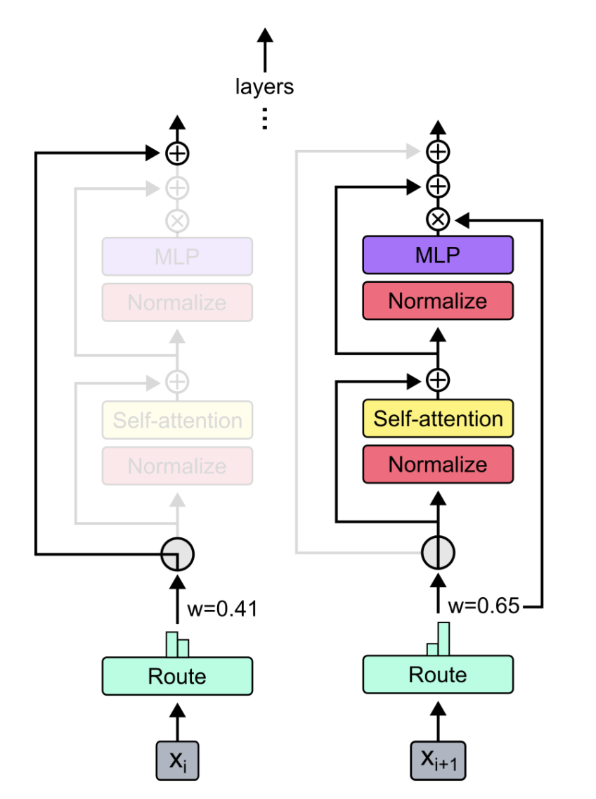

# PyTorch Mixtures

A plug-and-play module for <a href="https://arxiv.org/abs/2202.08906">Mixture-of-Experts</a> and <a href="https://arxiv.org/abs/2404.02258">Mixture-of-Depths</a> in PyTorch. Your one-stop solution for inserting MoE/MoD layers into custom neural networks effortlessly!

 -- 

Sources:

1. <a href="https://arxiv.org/abs/1701.06538">Sparse Mixture of Experts, 2017</a>
2. <a href="https://arxiv.org/abs/2404.02258">Mixture of Depths, 2024</a>

## Features/Todo

- [x] Mixture of Experts
    - [x] Top-k Routing
    - [x] Expert Choice Routing
    - [x] router-z loss
    - [x] load-balancing loss
    - [x] Testing of all MoE protocols - finished
- [x] Mixture of Depths
    - [x] capacity-based routing around attention layer
    - [ ] Testing of MoD protocol - finished

## Installation

Simply using `pip3 install pytorch-mixtures` will install this package. Note that this requires `torch` and `einops` to be pre-installed as dependencies. If you would like to build this package from source, run the following command:

```bash
git clone https://github.com/jaisidhsingh/pytorch-mixtures.git
cd pytorch-mixtures
pip3 install .
```

## Usage

`pytorch-mixtures` is designed to effortlessly integrate into your existing code for any neural network of your choice, for example

```python
from pytorch_mixtures.routing import ExpertChoiceRouter
from pytorch_mixtures.moe_layer import MoELayer

import torch
import torch.nn as nn


# define some config
BATCH_SIZE = 16
SEQ_LEN = 128
DIM = 768
NUM_EXPERTS = 8
CAPACITY_FACTOR = 1.25

# first initialize the router
router = ExpertChoiceRouter(dim=DIM, num_experts=NUM_EXPERTS)

# choose the experts you want: pytorch-mixtures just needs a list of `nn.Module` experts
# for e.g. our experts are just linear layers
experts=[nn.Linear(DIM, DIM) for _ in range(NUM_EXPERTS)]

# supply the router and experts to the MoELayer for modularity
moe = MoELayer(
    num_experts=NUM_EXPERTS, 
    router=router, 
    experts=experts, 
    capacity_factor=CAPACITY_FACTOR
)

# initialize some test input
x = torch.randn(B, N, D)

# pass through moe
moe_output = moe(x) # shape: [B, N, D]
```

You can also use this easily within your own `nn.Module` classes

```python
from pytorch_mixtures.routing import ExpertChoiceRouter
from pytorch_mixtures.moe import MoELayer
from pytorch_mixtures.utils import MHSA # multi-head self-attention layer provided for ease
import torch
import torch.nn as nn


class CustomMoEAttentionBlock(nn.Module):
    def __init__(self, dim, num_heads, num_experts, capacity_factor, experts):
        super().__init__()
        self.attn = MHSA(dim, num_heads)
        self.router = ExpertChoiceRouter(dim, num_experts)
        self.moe = MoELayer(dim, router, experts, capacity_factor)
        
        self.norm1 = nn.LayerNorm(dim)
        self.norm2 = nn.LayerNorm(dim)
    
    def forward(self, x):
        x = self.norm1(self.attn(x) + x)
        x = self.norm2(self.moe(x) + x)
        return x


experts = [nn.Linear(768, 768) for _ in range(8)]
my_block = CustomMoEAttentionBlock(
    dim=768,
    num_heads=8,
    num_experts=8,
    capacity_factor=1.25,
    experts=experts
)

# some test input
x = torch.randn(16, 128, 768)
output = my_block(x) # shape: [16, 128, 768]
```

# Citation

If you found this package useful, please cite it in your work:

```bib
@misc{JaisidhSingh2024,
  author = {Singh, Jaisidh},
  title = {pytorch-mixtures},
  year = {2024},
  publisher = {GitHub},
  journal = {GitHub repository},
  howpublished = {\url{https://github.com/jaisidhsingh/pytorch-mixtures}},
}
```

# References

This package was built with the help of open-source code mentioned below:
1. <a href="https://github.com/google/flaxformer">Google Flaxformer</a>
2. <a href="https://github.com/lucidrains/st-moe-pytorch">ST-MoE by Lucidrains</a>
3. <a href="https://huggingface.co/blog/joey00072/mixture-of-depth-is-vibe">MoD Huggingface blog</a>
