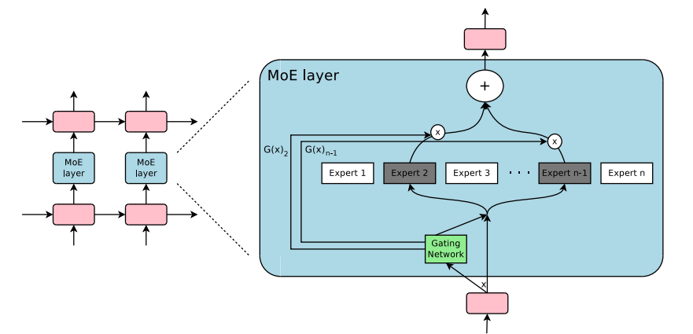

# PyTorch Mixtures <a href="https://pypi.org/project/pytorch-mixtures/">[PyPi]</a>

A plug-and-play module for <a href="https://arxiv.org/abs/2202.08906">Mixture-of-Experts</a> and in PyTorch. Your one-stop solution for inserting MoE layers into custom neural networks effortlessly!



## Installation

Simply using `pip3 install pytorch-mixtures` will install this package. Note that this requires `torch` and `einops` to be pre-installed as dependencies. If you would like to build this package from source, run the following command:

```bash
git clone https://github.com/jaisidhsingh/pytorch-mixtures.git
cd pytorch-mixtures
pip3 install .
```

## Usage

`pytorch-mixtures` is designed to effortlessly integrate into your existing code for any neural network of your choice, for example

```python
import torch
from pytorch_mixtures import TopkMoE, ExpertChoiceMoE, MoEConfig


BATCH_SIZE = 16
SEQ_LEN = 128
DIM = 768
NUM_EXPERTS = 8
CAPACITY_FACTOR = 1.25

config = MoEConfig(
    hidden_dim=DIM,
    intermediate_dim=DIM * 4,
    num_experts=NUM_EXPERTS,
    expert_fn="ff",
    expert_act="silu",
    router_fn="topk",
    capacity_factor=CAPACITY_FACTOR,
    topk=2,
    dtype=torch.float32
)

moe = TopkMoE(config)

x = torch.randn(BATCH_SIZE, SEQ_LEN, DIM)
output = moe(x)  # shape: [BATCH_SIZE, SEQ_LEN, DIM]
```

You can also use this easily within your own `nn.Module` classes

```python
import torch
import torch.nn as nn
from pytorch_mixtures import TopkMoE, ExpertChoiceMoE, MoEConfig


class CustomMoEBlock(nn.Module):
    def __init__(self, dim, num_experts, capacity_factor):
        super().__init__()
        self.config = MoEConfig(
            hidden_dim=dim,
            intermediate_dim=dim * 4,
            num_experts=num_experts,
            expert_fn="ff",
            expert_act="silu",
            router_fn="topk",
            capacity_factor=capacity_factor,
            topk=2,
            dtype=torch.float32
        )
        self.moe = TopkMoE(self.config)
        
    def forward(self, x):
        return self.moe(x)


my_block = CustomMoEBlock(
    dim=768,
    num_experts=8,
    capacity_factor=1.25
)

x = torch.randn(16, 128, 768)
output = my_block(x)  # output shape: [16, 128, 768]
```

# Testing

This package provides the user to run a simple test for the MoE code. If all experts are initialized as the same module, the output of the MoE should be equal to the input tensor passed through any expert. The users can run these tests for themselves by running the following:

```python
from pytorch_mixtures import run_tests

run_tests()
```

Or from the command line:
```bash
python -m tests.tests
```

Note: All tests pass correctly. If a test fails, it is likely due to an edge case in the random initializations. Try again, and it will pass.

# Citation

If you found this package useful, please cite it in your work:

```bib
@misc{JaisidhSingh2024,
  author = {Singh, Jaisidh},
  title = {pytorch-mixtures},
  year = {2024},
  publisher = {GitHub},
  journal = {GitHub repository},
  howpublished = {\url{https://github.com/jaisidhsingh/pytorch-mixtures}},
}
```
